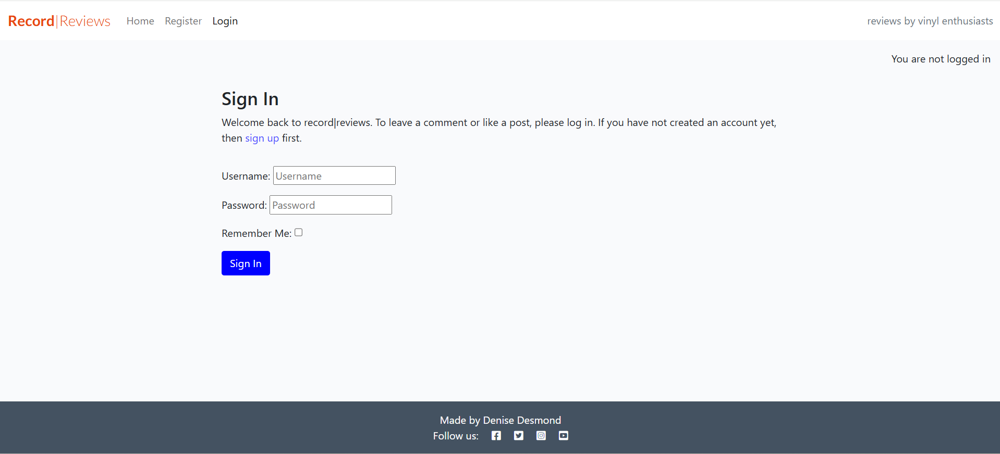
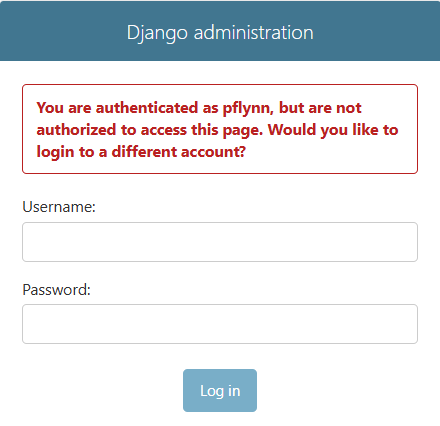

# Record Reviews
### By Denise Desmond

live site - https://capstone-project-recordreviews-5a6a26926cda.herokuapp.com/

project board - https://github.com/users/Dee-Des/projects/11

## Index
1. [Overview](#overview)
2. [UX Design Process](#ux-design-process)
    - [User Stories](#user-stories)
    - [Wireframes](#wireframes)
    - [Color Schemes](#color-schemes)
    - [Imagery/Media](#imagery)
    - [Responsiveness](#responsiveness)
    - [Fonts](#fonts)
3. [Features](#features)
4. [Improvements and Future Development](#improvements-and-future-development)
5. [Deployment](#deployment)
6. [Testing and Validation](#testing-and-validation)
7. [AI implementation](#ai-implementation)
8. [Database](#database)
    - [ERD](#erd)
9. [References](#references)
10. [Credits](#credits)
11. [Agile](#agile)
12. [Tech used](#tech-used)
13. [Learning points](#learning-points)
14. [Acknoledgements](#acknowledgements)

## Overview

A website built using Django which allows users to share and review vinyl records. I was inspired to build Record Reviews by my own interest in vinyl collection and the fact I have friends who own and run independent record labels.Record Reviews is my Full Stack Capstone Project. This project uses and demonstrates a culmination of my learning on the course.

Technologies and Methodologies used:

- PostgreSQL, integrated through Django - for Database Management
- HTML, CSS, JavaScript - for Frontend Development
- Python, Django framework - for Backend Development:
- Cloudinary - for API
- Using AI tools, e.g. Copilot, ChatGPT 4.0, Diagram GPT in the planning and debugging process
- Agile methodology - for Project planning and tracking
- Git & GitHub - for Version Control
- Heroku - for deployment

## UX Design Process

project board - https://github.com/users/Dee-Des/projects/11/views/1

### User stories

Must Haves

- As a Site User I can view a paginated list of records so that I can select which record I want to view (Must Have)
- As a Site User I can click on a record so that I can read the full text (Must Have)
- As a Site User/Admin I can view reviews on an individual record So that I can read the conversation (Must Have)
- As a Site User I can register an account so that I can review a record (Must Have)
- As a Site User I can leave reviews on a record so that I can be involved in the conversation (Must Have)
- As a Site User I can modify or delete my review on a record so that I can be involved in the conversation (Must Have)
- As a Site Admin I can create, read, update and delete records so that I can manage my record content (Must Have)
- As a Site Admin I can create draft records so that I can finish writing the content later (Must Have)
- As a Site Admin I can approve or disapprove reviews so that I can filter out objectionable reviews (Must Have)

Should Haves

- As a Site User I can click on the About link so that I can read about the site (Should Have)
- As a Site Admin I can create or update the about page content so that it is available on the site (Should Have)

Could Haves

- As a Site User I can fill in a contact request form so that I can submit a request for contact (Could Have)
- As a Site Admin I can store contact requests in the database so that I can review them (Could Have)
- As a Site Admin I can mark contact requests as "read" so that I can see how many I still need to process (Could Have)

In the timeframe allowed I achieved all of my Must Have user stories and therefore achieved the project's MVP. In future improvements and enhancements I would work on achieving the Should Have and Could Have user stories mentioned above.

### Wireframes

Home Page

Join Page

Login Page

Logout Page

### Color schemes

### Imagery/Media

Images for the placeholder image on the Home Page, Home Page Page 2 (Paginated Pages) and for the image on the Record Detail page were taken from pexels.com. User-generated images on the Home Page are taken from my own collection.

Placeholder image

Record Detail page image

User generated images

### Responsiveness

Record Reviews is built to be fully responsive across all device sizes. This is to ensure an optimal user experience when accessed on mobile, tablet, or desktop. The design follows a mobile-first approach.

The layout adapts to different screen sizes thanks to the use of Flexbox and bootstrap.

Home page on Mobile

Home page on Tablet

Home page on Desktop

### Fonts

For the fonts I used sans‑serif fonts

## Features

Key features of the website include:

🏠 Home Page (/)	
- Responsive Bootstrap layout with grid system
- Navbar with links: Home, Register, Login/Logout
- Paginated record listings (title, author, featured image, excerpt)
- Each record card links to its detail page
- Featured image (via Cloudinary)
- Placeholder image when no user-generated image provided
- Footer with social media links (Facebook, Twitter, Instagram, YouTube)
- Confirmation message

Home Page - User logged in

Home Page - User not logged in

User has signed in confirmation message

📑 Paginated Listings (/?page=2, /?page=3, …)	

- Continuation of record listings with pagination controls
- Same layout and features as Home Page
- Ensures scalability for large record collections

Home Page - Page 2 - User logged in

Home Page - page 2 - User not logged in

🎼 Record Detail Page (//)	

- Full record information: title, artist, genre, year, record label, content
- Author attribution (user who created the record)
- Reviews section: reviewer name, body, timestamp
- Review form (visible to logged‑in users)
- Logged in authenticated users can add, edit and delete their own reviews
- Site users can view approved reviews 
- Review moderation: reviews require admin approval before appearing
- Confirmation messages

Record Detail page - User logged in

Record Detail page - User not logged in

Record Detail page - review added confirmation

Record Detail page - review updated confirmation

Record Detail page  - review deleted confirmation

🔐 Register Page (/accounts/signup/)

- User registration form with Bootstrap styling
- Validation messages for incorrect or missing input
- Creates new user accounts stored in Postgres
- Confirmation message

Register page

User has registered and signed in confirmation message

🔑 Login Page (/accounts/login/)	

- Login form with username and password fields
- Error messages for invalid credentials
- Redirects to Home Page after successful login
- Confirmation message

Login page

User has signed in confirmation message

🚪 Logout Page (/accounts/logout/)	

- Logs out the user
- Navbar updates to show “You are not logged in.”
- Confirmation message

Logout page

User has signed out confirmation message

⚙️ Admin Dashboard (/admin/)	

- Authentication required (staff/superuser only)
- Manage Record model: create, edit, delete records; set status (Draft/Published)
- Manage Review model: approve/disapprove reviews, edit/delete reviews
- Manage User model: assign staff/superuser permissions
- Built‑in search and filters
- Full CRUD operations for all models
- Confirmation messages

Authenticated superuser logged in

Admin page access is restricted

Admin page approve and disapprove reviews by toggling Approved checkbox as appropriate and selecting 'Save' button

Change record status on Admin page using Status dropdown and selecting Save button

Record created confirmation message on Admin

Record updated confirmation message on Admin

Record deleted confirmation message on Admin

✨ Key Technical Features include:

- Bootstrap integration for responsive design
- Cloudinary for image hosting
- Postgres database for records, reviews, and users
- Django models (Record, Review) with relationships
- Pagination for record listings

## Improvements and Future Development

In my future enhancements I would add in the full scope as mentioned also in ERD in the Database section and in user stories in th UX Design Process section of this README document. This would include the Should Have and Could Have User Stories mentioned in the UX Design Process section of this README document.

## Deployment

- Deployment is to Heroku
- High-Level Steps to deploy to Heroku: 
  1. Configure the Django settings to handle both development and production environments.
  2. Environment variables are used to manage sensitive information and configuration settings. 
  3. PostgreSQL is the database used for production on Heroku.
  4. WhiteNoise middleware is used to manage static files in production.
  5. Debug mode is set to False in the settings file before commiting and pushing to Github.
  6. The project is deployed to Heroku using Github integration. Deployment is from the main branch. 
  7. The requirements.txt file handles the dependecies to ensure that all required packages are installed in the production environment.
  8. The deployed to Heroku project is tested to check that the functionality and design are consistnt with those on the development environment.
  9. Testing and validation is carried out on the deployed to Herku project.
  10. To emphasise again environment variables store sensitive data and DEBUG is set to False in the production environment.

## Testing and Validation

Some of the Django generated code showed to be invalid during validation.

### HTML Validation

Home page

Home page - page 2

 

Record detail page

### CSS Validation

### Python Validation

admin.py

apps.py

forms.py

models.py - Alot of lines of code so I took two screenshots to try capture it all in the Linter

urls.py - one file in record and one in record_reviews

views.py - Alot of lines of code so I took three screenshots to try capture it all in the Linter

### JS Validation

No errors were displayed in JSHint - only warnings which could be ignored.

### Lighthouse

Home Page

Home Page - page 2

Record Detail page

### Testing

Manual Testing was carried out during the Development process and again after Deployments. Please see below Manual Testing Report which highlights key functionality testing.

# 📄 Manual Testing Report – Record Reviews Project

---

## 📌 Cover Page

**Project Title:** Record  Reviews – Capstone Project  
**Author:** Denise Desmond 
**Date of Testing:** December 2025  
**Purpose of Testing:**  
To validate that all features of the RecordReviews project function correctly across multiple devices (Desktop and Android). Testing includes navigation, CRUD operations for Records and Reviews, authentication, permissions, access control, notifications, and non‑functional requirements (validation, responsiveness, accessibility).  

**Devices Tested:**  
- Desktop (Windows)  
- Android (Mobile)  

**Overall Result:**  
✅ All features tested successfully. Expected and actual results matched across devices.  

---

# 🧪 Consolidated Manual Testing Matrix

| **Page/Area** | **Feature** | **Test Performed** | **Expected Result** | **Actual Result** | **Devices Tested** | **Status** |
|---------------|-------------|--------------------|---------------------|-------------------|--------------------|------------|
| Home (`/`) | Navbar links | Click Home, Register, Login | Correct page loads | Correct page loads | Desktop, Android | ✅ Pass |
| Home (`/`) | Record listings | Verify records display with title, author, excerpt, image | Records visible with correct info | Records visible | Desktop, Android | ✅ Pass |
| Home (`/`) | Pagination | Click “Next” page | Loads next set of records | Records load on Page 2 | Desktop, Android | ✅ Pass |
| Home (`/`) | Footer links | Click social media icons | Redirects to external social sites | Redirects correctly | Desktop, Android | ✅ Pass |
| Paginated Listings (`/?page=2`) | Pagination continuity | Navigate between pages | Records continue to display correctly | Records display correctly | Desktop, Android | ✅ Pass |
| Record Detail (`/<id>/`) | Record info | Open record detail | Full record info displayed | Info displayed correctly | Desktop, Android | ✅ Pass |
| Record Detail (`/<id>/`) | Reviews section | View approved reviews | Reviews show reviewer, body, timestamp | Reviews display correctly | Desktop, Android | ✅ Pass |
| Record Detail (`/<id>/`) | Review form (signed in) | Submit review | Review saved, pending admin approval | Review saved, hidden until approved | Desktop, Android | ✅ Pass |
| Record Detail (`/<id>/`) | Review visibility (not signed in) | Visit record detail page while logged out | Approved reviews are visible | Reviews visible | Desktop, Android | ✅ Pass |
| Record Detail (`/<id>/`) | Review form (not signed in) | Attempt to submit review while logged out | Form not available / redirect to login | Form hidden, prompt to log in | Desktop, Android | ✅ Pass |
| Record Detail (`/<id>/`) | Review ownership – Add/Edit/Delete | User manages own review | Only own reviews editable/deletable | Works as expected | Desktop, Android | ✅ Pass |
| Record Detail (`/<id>/`) | Review ownership – Other users | Attempt to edit/delete another’s review | Permission denied | Options not visible | Desktop, Android | ✅ Pass |
| Register (`/accounts/signup/`) | Registration form | Submit valid details | Account created | Account created | Desktop, Android | ✅ Pass |
| Register (`/accounts/signup/`) | Validation | Submit invalid/missing details | Error messages displayed | Errors displayed | Desktop, Android | ✅ Pass |
| Login (`/accounts/login/`) | Login form | Enter valid credentials | User logged in, redirected to Home | Works as expected | Desktop, Android | ✅ Pass |
| Login (`/accounts/login/`) | Validation | Enter invalid credentials | Error message shown | Error shown | Desktop, Android | ✅ Pass |
| **Login (`/accounts/login/`)** | Login notification | Successful login | Confirmation message displayed | Message displayed | Desktop, Android | ✅ Pass |
| Logout (`/accounts/logout/`) | Logout action | Click logout | User logged out, confirmation shown | Works as expected | Desktop, Android | ✅ Pass |
| **Logout (`/accounts/logout/`)** | Logout notification | Successful logout | Confirmation message displayed | Message displayed | Desktop, Android | ✅ Pass |
| **Global (Navbar)** | Logged‑in state indicator | Check navbar when logged in/out | Shows “You are logged in” or “You are not logged in” | Correct state shown | Desktop, Android | ✅ Pass |
| **Templates** | HTML validation | Run templates through W3C validator | No validation errors | No errors found | Desktop | ✅ Pass |
| **CSS** | CSS validation | Run stylesheets through Jigsaw validator | No validation errors | No errors found | Desktop | ✅ Pass |
| **Global (Responsive Design)** | Responsiveness | Resize browser / test on Android | Layout adapts to screen width | Responsive across devices | Desktop, Android | ✅ Pass |
| **Global (Accessibility)** | Accessibility & performance | Test with Lighthouse/Wave | Meets minimum accessibility/performance | Requirements met | Desktop | ✅ Pass |
| **Records (Frontend Form)** | Record – Create | Logged‑in user submits record form | Record created and saved | Record created successfully | Desktop, Android | ✅ Pass |
| **Records (Frontend Form)** | Record – Create notification | After record creation | Confirmation message displayed | Message displayed | Desktop, Android | ✅ Pass |
| **Records (Frontend Form)** | Record – Edit | Logged‑in user edits own record | Changes saved and updated | Works as expected | Desktop, Android | ✅ Pass |
| **Records (Frontend Form)** | Record – Edit notification | After record edit | Confirmation message displayed | Message displayed | Desktop, Android | ✅ Pass |
| **Records (Frontend Form)** | Record – Delete | Logged‑in user deletes own record | Record removed | Works as expected | Desktop, Android | ✅ Pass |
| **Records (Frontend Form)** | Record – Delete notification | After record deletion | Confirmation message displayed | Message displayed | Desktop, Android | ✅ Pass |
| **Records (Frontend Form)** | Record manipulation (logged‑out) | Attempt to create/edit/delete while logged out | Access denied | Access denied | Desktop, Android | ✅ Pass |
| **Records (Restricted Access)** | Authorised access | Attempt to access restricted records/information | Only authorised users can access | Access correctly restricted | Desktop, Android | ✅ Pass |
| Admin (`/admin/`) | Authentication | Attempt login as non-admin | Access denied | Access denied | Desktop, Android | ✅ Pass |
| Admin (`/admin/`) | Record – Create | Add new record via admin | Record saved and visible on site | Record created successfully | Desktop, Android | ✅ Pass |
| Admin (`/admin/`) | Record – Read | View record list in admin | Records display with correct info | Records display correctly | Desktop, Android | ✅ Pass |
| Admin (`/admin/`) | Record – Update | Edit record details | Changes saved and reflected on site | Changes applied correctly | Desktop, Android | ✅ Pass |
| Admin (`/admin/`) | Record – Delete | Delete a record | Record removed from site | Record deleted successfully | Desktop, Android | ✅ Pass |
| Admin (`/admin/`) | Review – Create | Add new review via admin | Review saved and linked to record | Review created successfully | Desktop, Android | ✅ Pass |
| Admin (`/admin/`) | Review – Read | View review list in admin | Reviews display with correct info | Reviews display correctly | Desktop, Android | ✅ Pass |
| Admin (`/admin/`) | Review – Update | Edit review details | Changes saved and reflected on site | Changes applied correctly | Desktop, Android | ✅ Pass |
| Admin (`/admin/`) | Review – Delete | Delete a review | Review removed from site | Review deleted successfully | Desktop, Android | ✅ Pass |

---

# ✅ Summary

- All **functional tests** (login state, registration, authentication, CRUD for records and reviews, notifications, permissions) passed.  
- All **non‑functional tests** (HTML validation, CSS validation, responsiveness, accessibility & performance) passed.  
- Tested thoroughly on **Desktop (Windows)** and **Android mobile devices**.  
- **Status: Pass** for all features.

## AI Implementation

AI tools were used to assist with planning, code suggestions, debugging, troubleshooting, and accessibility & performance checks. 

Copilot, ChatGPT 4.0, Diagram GPT and Eraser.io proved particularly helpful with planning.

Copilot was very helpful with code suggestions, debugging & troubleshooting.
Lighthouse was used for accessiblity & performance checks.

It is worth noting that I chose to use AI outside of my Visual Studio Code. The reasons for this were twofold. Firstly I wanted to maintain full control over my code. Secondly I wanted to gain as much knowledge about full stack software development on this course as I possibly could. I feel I have achieved both.

## Database

The database is a Postgres database hosted by Code Insitute.

### ERD

This is the ERD for the full scope of the project. In future enhancements I would add in full scope.

## References

At a high level,the key ones are:

- Django Documentation
- Project brief by Code Institute
- Bootstrap 5.3 Documentation.
- Course materials by Code Institute

## Credits

### Code

* Extra code was adapted from Code Institute's walkthrough project - 'Codestar' project.

### Record details content

* Adapted from wikipaedia

### ERD

* Created with assistance from Diagram GPT and Eraser.io

### Imagery/Media

* The imagery/media for the placeholder image on the Home Page and Home Page Page 2 was taken from pexels.com as was the image on the Record Detail page

### Colour scheme 

* The palette was created from the project's css stylesheet with assistance from Figma

## Agile

- A Kanban/Project board on Github was used to track tickets/user stories.
- This project was managed using agile principles.
- Development of features took guidance from user stories and MOSCOW prioritisation.

## Tech used

- PostgreSQL, integrated through Django - for Database Management
- HTML, CSS, Bootstrap, JavaScript - for Frontend Development
- Python, Django framework - for Backend Development
- Cloudinary - API
- Using AI tools, e.g. Copilot, ChatGPT 4.0, Diagram GPT in the planning and debugging process
- Agile methodology - for Project planning and tracking
- Git & GitHub - for Version Control
- Heroku - for deployment (Sensitive data stored securely in Heroku config)
- Font Awesome Icons, Google Fonts, Balsamiq

## Learning Points

Reinforced importance of .gitignore and secure handling of environment variables.

The env.py got mistakenly pushed to github so I created a new database, remigrated the models and repopulated the tables. I removed the env.py from the latest commit but it will still appear in prevous commits. I generated a new Django key and a new Cloudinary API key. As a result of this the project was not compromised. Although this was frustrating I learned alot more than had I got it right the first time.

## Acknowledgements

Sincere thank you to the Code Institute staff team - special mentions Dillon McCaffrey, Tom Cowen and Mark Briscoe for their consistent encouragement and support throughout.

Thank you also to my peers in Code Institute and to open‑source contributors.

